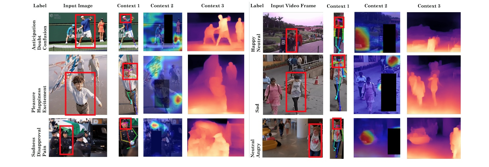


<video autoplay loop>
  <source src="/images/sequence.mp4" type="video/mp4">
</video>


# Welcome to IDEAS Lab

Welcome to the interdisciplinary research lab, [IDEAS](https://ideas.purdue.edu) (*Intelligent Design for Empathetic and Augmented Systems*) at Purdue Computer Science. Our research includes the design and implementation of scientific algorithms leveraging the "human in the loop" and their applications to computer graphics, robotics, AI, virtual environments, augmented intelligence, pedestrian and crowd dynamics, and medical / healthcare research.

Our research also focuses on building embodied computational models of human social behavior, developing component algorithms of an intelligent agent (from sensing, to decision-making, to actuating). Our long-term research goal is to create engaging, socially intelligent agents that can interact with humans in innovative ways through expressive multi-modal interaction.

Some recent work includes combining these methods with machine learning, computer vision, and physically-based modeling for Autonomous Driving, Affective Computing and Reconstructing Reality. In addition to publishing papers at the leading venues, we have a long history of developing software packages and transitioning our technology into industrial products.



<!-- 

{:.center} -->



  

    

    

    

    

    

    

  

  

<!--  -->



# Research highlights



<!-- 
Lorem ipsum dolor sit amet, consectetur adipiscing elit, sed do eiusmod tempor incididunt ut labore et dolore magna aliqua.
Ut enim ad minim veniam, quis nostrud exercitation ullamco laboris nisi ut aliquip ex ea commodo consequat.


{:.center}





Duis aute irure dolor in reprehenderit in voluptate velit esse cillum dolore eu fugiat nulla pariatur.
Excepteur sint occaecat cupidatat non proident, sunt in culpa qui officia deserunt mollit anim id est laborum.


{:.center}





Lorem ipsum dolor sit amet, consectetur adipiscing elit, sed do eiusmod tempor incididunt ut labore et dolore magna aliqua.


{:.center}




Lorem ipsum dolor sit amet, consectetur adipiscing elit, sed do eiusmod tempor incididunt ut labore et dolore magna aliqua.
Ut enim ad minim veniam, quis nostrud exercitation ullamco laboris nisi ut aliquip ex ea commodo consequat. -->

# Follow us


  

    <a class="twitter-timeline" href="https://twitter.com/anikbera?ref_src=twsrc%5Etfw" data-height="700" data-width="350">Tweets by anikbera</a> 
  





