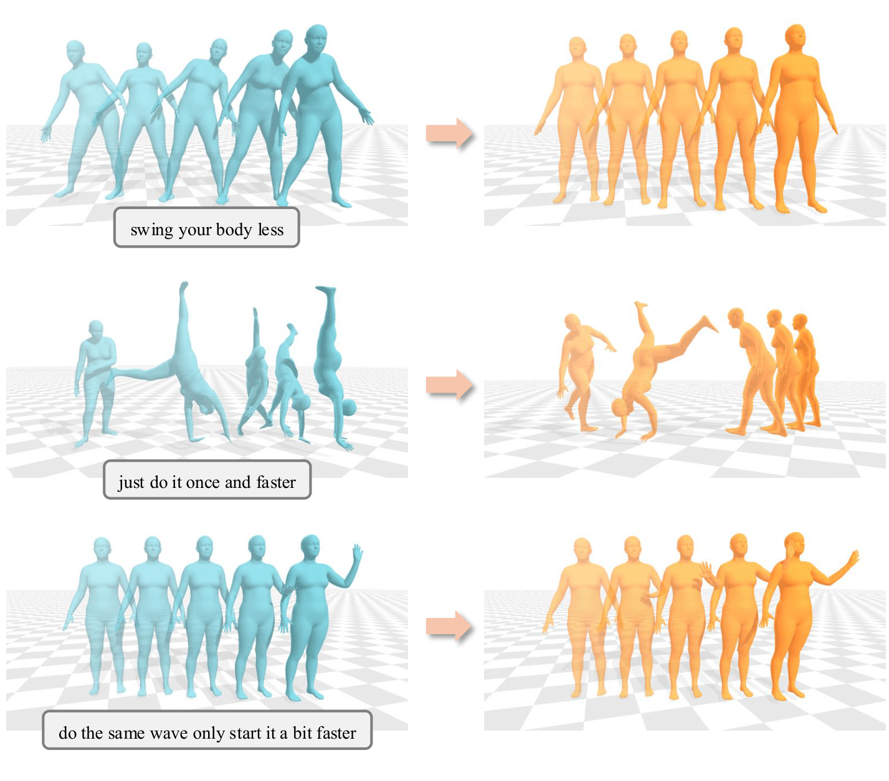
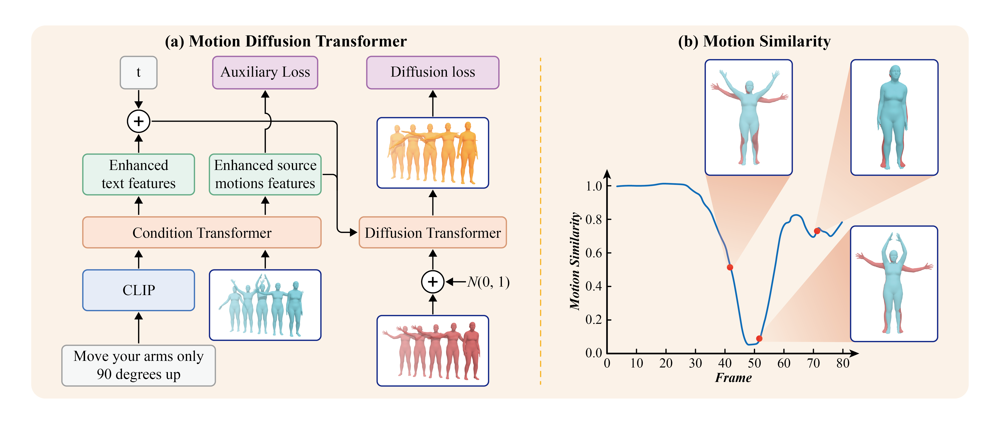
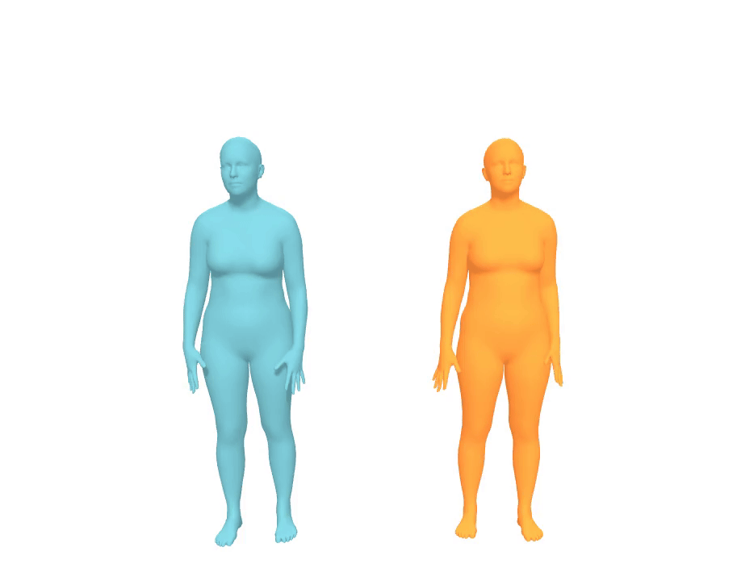

<style type="text/css">
  table td {
    border: none !important;
    padding: none !important;
  }
</style>
# SimMotionEdit: Text-Based Human Motion Editing with Motion Similarity Prediction


### Abstract
{:.left}
Text-based 3D human motion editing is a critical yet challenging task in computer vision and graphics. While training-free approaches have been explored, the recent release of the MotionFix dataset, which includes source-text-motion triplets, has opened new avenues for training, yielding promising results. However, existing methods struggle with precise control, often leading to misalignment between motion semantics and language instructions. In this paper, we introduce a related task, motion similarity prediction, and propose a multi-task training paradigm, where we train the model jointly on motion editing and motion similarity prediction to foster the learning of semantically meaningful representations. To complement this task, we design an advanced Diffusion-Transformer-based architecture that separately handles motion similarity prediction and motion editing. Extensive experiments demonstrate the state-of-the-art performance of our approach in both editing alignment and fidelity.



{:.left}

### Method

Our novelty is proposing a multi-task training framework to improve the model's editing ability.

Our auxiliary task of motion similarity prediction follows the intuition that to edit a motion, the model must first identify the parts that need editing. Put differently, given the source and the edited motions, it should quantify the similarities between them. We show an instance of motion similarity curve in (b).

We illustrate our network architecture, the Motion Diffusion Transformer, in (a). It consists of a condition transformer and a diffusion transformer. The condition transformer processes the source motion and the text instructions, and provides enhanced condition features via motion similarity prediction. The diffusion transformer takes in the concatenated sequence of enhanced source motion features and noised edited motion, and uses the enhanced text features as conditions, to generate edited motions. We train the network jointly on motion similarity prediction and diffusion-based motion editing.



### Performance

<span style="color:blue;">blue</span> = source motion

<span style="color:orange;">orange</span> = edited motion

<div class="column is-centered has-text-centered">
  <table>
      <tr>
      <td>
        <span style="font-weight:bold;">do it slower and don't get up</span>
      </td>
      <td>
        <span style="font-weight:bold;">move your arms only 90 degrees up</span>
      </td>
      <td>
          <span style="font-weight:bold;"> sit slowly and delay your throwing motions </span>
      </td>
    </tr>
    <tr>
      <td>
        
      </td>
      <td>
        
      </td>
      <td>
        
      </td>
    </tr>
            <tr>
      <td>
        <span style="font-weight:bold;">just do it once and faster</span>
      </td>
      <td>
        <span style="font-weight:bold;">keep waving instead of lowering your hands</span>
      </td>
      <td>
          <span style="font-weight:bold;">walk two small steps ahead and one backwards</span>
      </td>
    </tr>
    <tr>
      <td>
        
      </td>
      <td>
        
      </td>
      <td>
        
      </td>
    </tr>
  </table>
</div>


### Citation

{:.left}

```
@article{li2025simmotionedittextbasedhumanmotion,
      title={SimMotionEdit: Text-Based Human Motion Editing with Motion Similarity Prediction}, 
      author={Zhengyuan Li and Kai Cheng and Anindita Ghosh and Uttaran Bhattacharya and Liangyan Gui and Aniket Bera},
      year={2025},
      eprint={2503.18211},
      archivePrefix={arXiv},
      primaryClass={cs.CV}
}
```